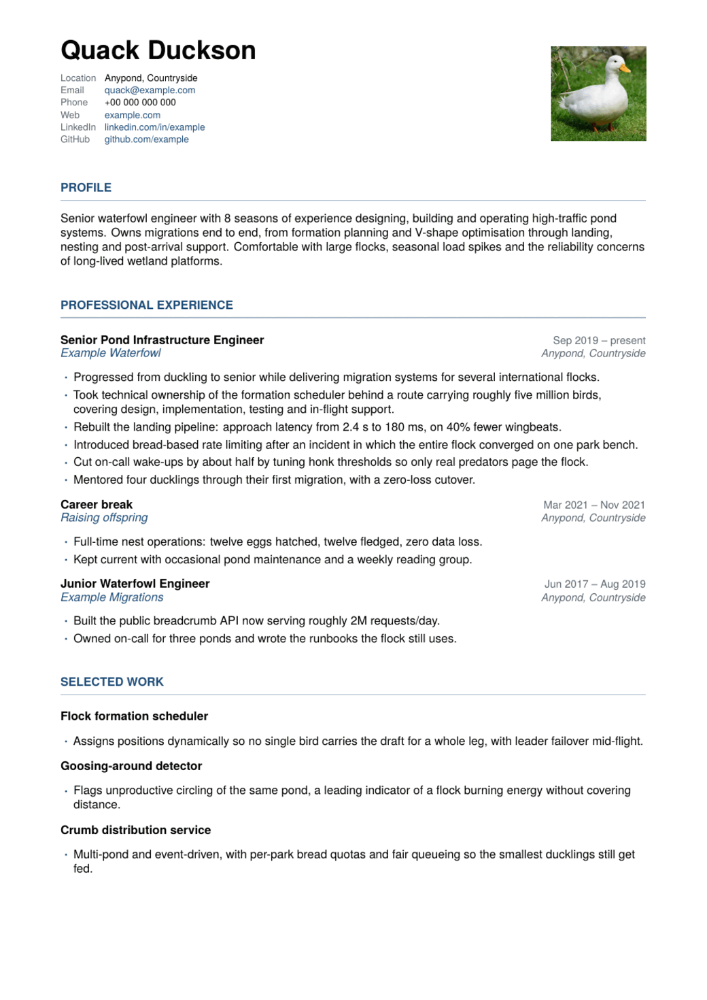
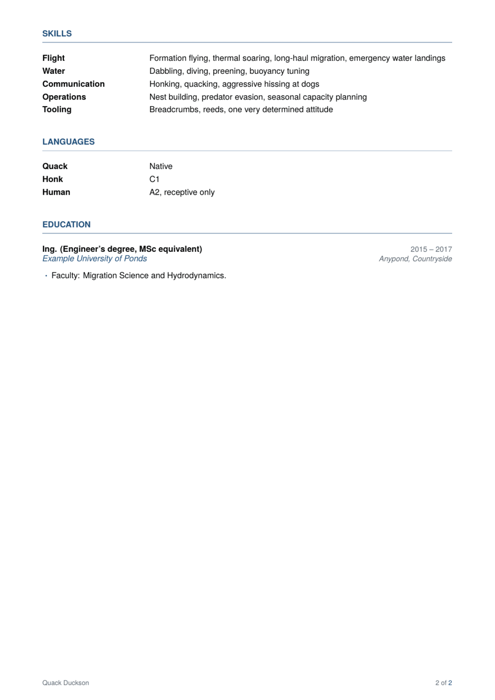

# CV Generator

You write your CV as plain notes. Claude turns the notes into LaTeX. LaTeX turns
that into a PDF.

The point is that your CV has one source - a single readable file - and
everything else is either generated from it or is pure styling. Change a job
title in one place, rebuild, and the PDF is correct.

<p align="center">
  
  
</p>

<p align="center">
  <em>Both pages of the CV built from the bundled <code>me.example.md</code>,
  with nothing installed but podman.</em>
</p>

## Quick start

```bash
git clone <this-repo> && cd cv
cp me.example.md me.md          # then replace the content with your own
claude                          # and say: build my CV
```

The first build takes about a minute while the toolchain image is built; after
that, about a second. There is nothing else to install.

---

## The loop

Writing a CV is not one pass. This is the cycle the project is built around, and
it is worth knowing before you start, because each step feeds the next.

```
   edit me.md  ->  build  ->  read the PDF  ->  review  ->  edit me.md
        ^                                                        |
        +--------------------------------------------------------+
```

1. **Add what you remember.** Dump it into `me.md` roughly. Wording does not
   matter yet; getting the facts down does. One achievement per bullet.
2. **Build it.** "Build my CV". You now have a page to look at rather than a
   file to imagine.
3. **Read the PDF, not the Markdown.** Length, balance and what a skim actually
   catches only exist in the rendered document.
4. **Ask for a review.** "Review my CV" runs the `cv-review` skill:
   unsupportable claims first, then shape, then the weakest bullets with
   rewrites, then what to cut.
5. **Feed the questions back.** A good review mostly returns questions - how
   many people, how much did it save, what scale. Answer them in `me.md` and go
   round again. That is where the CV actually improves.

### What the loop is really for

Most of what makes a CV weak is invisible until it is on a page:

- **Duplication.** A Summary sentence and a bullet saying the same thing look
  fine separately and waste three lines together.
- **Claims without evidence.** "Significant impact" survives in a draft and dies
  in a review. Name the system instead.
- **Missing numbers.** The single most common gap. A review will keep asking;
  the answer has to come from you, and the CV is never invented to fill it.
- **The page fighting back.** When something no longer fits, that is
  information. Cut the weakest line, not the newest one.

### When it stops fitting

In order: cut the weakest bullets, collapse old roles, drop sections the target
does not care about, tighten wording. Adjust spacing last, in `style/cv.sty`,
and shrink the type only when there is genuinely nothing left to cut - a
squeezed CV reads worse than a shorter one.

---

## How it works

```
1  me.md                                       ← you edit this
   ## Experience
   ### Senior Backend Engineer - Example Ltd.
   - Dates: 2019-09 - present
   - Rebuilt the settlement pipeline…
        │
        │   Claude reads the notes and writes LaTeX. Each entry becomes
        │   a \cvjob{…} plus an itemize list; & % $ # _ are escaped on
        │   the way through. Nothing parses me.md - Claude just reads it.
        ▼
2  output/cv.tex                               generated, never hand-edited
   \usepackage{cv}            ───────────┐
   \cvheader{Alex Carter}{…}             │  resolved when TeX runs, via
   \cvjob{Role}{Company}{dates}{place}   │  TEXINPUTS, which compile.sh
   \begin{itemize} …                     │  points at two directories:
        │                                │
        │                                ├─ style/cv.sty     fonts, colours,
        │                                │                   margins, the macros
        │                                │                   used just above
        │                                └─ assets/photo.jpg  pulled in only if
        │                                                     the file exists
        │
        │   compile.sh runs xelatex twice - pass 1 writes .aux, pass 2
        │   settles cross-references and the final page count. If xelatex
        │   is missing it falls back to pdflatex automatically.
        ▼
3  output/cv.pdf                               the CV, plus cv.log
                                               (page count, warnings);
                                               aux files are cleaned up
```

**Two files are yours**: `me.md` for content, `style/cv.sty` for appearance.
Everything under `output/` is generated.

Note what the diagram implies: `cv.tex` never mentions a colour, a font or a
margin. It says `\cvjob{...}`; what that *looks* like is decided entirely by
`style/cv.sty` at compile time. That separation is what makes the next part
work.

### Why `cv.tex` is disposable

It is thrown away and rewritten on every build, deliberately. That means `me.md`
and the PDF can never disagree: there is no way to quickly patch the LaTeX and
leave your notes stale, because the patch would be erased next build. Edit the
notes, rebuild.

Which is exactly why styling lives in a separate file. If the colours sat inside
`cv.tex`, every rebuild would wipe your design work. Splitting them lets the
generated half be destroyed freely while the hand-made half survives.

That is the whole architecture - one rule and its consequence.

---

## Getting started

### 1. Nothing to install

If you have `podman` or `docker`, you are done. The first build detects that
there is no TeX on the machine, builds the toolchain image from
`tools/Containerfile` and compiles inside it. That takes a couple of minutes
once; every build after it takes about a second.

If you already have a TeX installation with `xelatex`, it is used directly and
no container is involved.

Only if you have neither will a build stop and ask you to install one of them.

Nothing keeps running afterwards: each build starts a container, compiles, and
removes it. What stays is the image itself, about 650 MB, which is what makes
later builds take a second instead of a minute. To reclaim the space when you
are done:

```bash
podman rmi cv-tex:latest        # or: docker rmi cv-tex:latest
```

The next build simply rebuilds it.

### 2. Write your `me.md`

Copy the example and replace the content with your own:

```bash
cp me.example.md me.md
```

If you are in this repo already, the quickest route is to say **"interview me
and write me.md"** - the skill knows the format and will ask the questions.

If your career is scattered across an old CV, a LinkedIn profile or a long chat
history, paste this prompt into Claude anywhere that already has the context:

<details>
<summary><strong>Prompt: turn what you know about me into a <code>me.md</code></strong></summary>

> Write everything you know about my career as a `me.md` profile file for a LaTeX CV
> generator. Use exactly this structure - Markdown, `##` for sections, `###` for each
> role or degree:
>
> ```markdown
> # <my name>
>
> ## Title
> <one-line professional title>
>
> ## Contact
> - Email:
> - Phone:
> - Location:
> - LinkedIn:
> - GitHub:
>
> ## Summary
> <2-4 sentences: what I do, how long, what I am known for>
>
> ## Experience
>
> ### <Role> - <Organisation>
> - Dates: YYYY-MM - YYYY-MM        (or "present")
> - Location: <City, Country>
> - <one achievement per bullet, result first, with the number where I gave you one>
>
> ## Skills
> - <Category>: <comma-separated list>
>
> ## Languages
> - <Language>: <CEFR level, or "native">
>
> ## Education
>
> ### <Degree> - <Institution>
> - Dates: YYYY - YYYY
> - Location: <City, Country>
>
> ## Notes (not printed)
> - <private context: target roles, what to leave out, gaps to explain>
> ```
>
> Rules: use only facts I have actually given you. Never invent an employer, date,
> degree, metric or skill. Where something is missing, add a line under
> `## Notes (not printed)` saying what you need from me - do not guess and do not
> leave a placeholder in the CV body. Keep my own wording where it is good; tighten
> bullets that ramble. Output the file contents only, no commentary.

</details>

Save the result as `me.md` and fill in whatever it flagged as missing.

### 3. Build

Say **"build my CV"**, or run it yourself:

```bash
bash .claude/skills/latex-cv/scripts/compile.sh output/cv.tex
```

---

## Writing `me.md`

Markdown with `##` headings for sections and `###` for each role or degree.
Inside an entry, lines starting with `Dates:`, `Location:`, `Stack:` or `Link:`
are metadata; every other `-` line becomes a bullet on the CV.

```markdown
### Senior Backend Engineer - Example Ltd.

- Dates: 2019-09 - present
- Location: Anytown, CZ
- Took technical ownership of the payments service; cut p99 latency from 2.4 s to 180 ms.
```

### How strict is this?

Not strict at all. Nothing parses `me.md` - there is no schema and no validator,
only Claude reading it. Prose works fine:

```markdown
### Backend Engineer - Example Ltd.

Joined in autumn 2019 as a mid-level dev, made senior after about two years. The thing I am proudest of is the
settlement pipeline rewrite - p99 went from 2.4 s to 180 ms and we dropped roughly 40% of the nodes.
```

An unrecognised `## Heading` simply becomes its own CV section, where it sits in
the file.

So why the conventions? **Reproducibility.** `cv.tex` is regenerated on every
build, so anything ambiguous is re-decided each time. `Dates: 2019-09 - present`
renders identically forever; "autumn 2019 until now" is a judgment call that may
come out differently next month. Structure the facts that must render
predictably - dates, locations, section order - and write prose everywhere else.
Bullets that ramble are expected; the skill is allowed to tighten them, and will
keep your numbers exactly as written.

### Private notes

A `## Notes (not printed)` section never reaches the PDF. Use it for anything
that should steer the CV without appearing on it - target roles, what to leave
out, how to explain a gap. It is read when tailoring to a job ad.

---

## Everyday use

| you say                                        | you get                                     |
|------------------------------------------------|---------------------------------------------|
| "Build my CV"                                  | `output/cv.tex` + `output/cv.pdf`           |
| "I updated me.md, regenerate"                  | both rewritten from scratch                 |
| "Make the accent green"                        | a one-line edit in `style/cv.sty`           |
| "Make it prettier" / "it looks like a template" | a design review, then edits to `cv.sty`    |
| "Make it one page"                             | a shorter CV, plus a report of what was cut |
| "Tailor it to this job ad: …"                  | `output/tailored/<company>-<role>/`         |
| "Review my CV" / "are these bullets any good?" | a critique with concrete rewrites           |

---

## Customising

### Appearance

Everything lives in `style/cv.sty`, which opens with a `STYLE KNOBS` block:
accent colour, muted colour, hairline colour, skills label width, name size,
photo file and size, and the `geometry` line for margins.

Below the knobs it defines the building blocks the generated `cv.tex` uses:

| command                     | what it is                                                |
|-----------------------------|-----------------------------------------------------------|
| `\cvheader`                 | name, the contact block, and an optional role line        |
| `cvcontacts` / `\cvcontact` | one contact per line, labels aligned                      |
| `\cvjob`                    | role, organisation, dates, location - dates right-aligned |
| `cvskills`                  | aligned label/value block, used for Skills and Languages  |

Changing the look means editing this one file. `cv.tex` never changes.

### Profile picture

Optional. Put a photo at `assets/photo.jpg` and the header becomes two-column -
name and contacts on the left, photo on the right. Remove the file and the
header re-centres. There is no switch to flip.

`assets/photo-placeholder.jpg` is a stand-in, and it is a duck, so that nobody
ships it by accident. Copy it to `assets/photo.jpg` to see the layout, then swap
in your own:

```bash
cp assets/photo-placeholder.jpg assets/photo.jpg
```

A square image works best; it is scaled to width, not cropped. To change the
size or use a different file (`.png` and `.pdf` work too):

```latex
\newcommand{\cvphotofile}{photo.jpg}   % in assets/
\newcommand{\cvphotosize}{2.8cm}       % width of the photo
```

CV photos are expected in much of Europe but discouraged in the US, UK and
Ireland, where they can get an application filtered out. Delete the file for
those markets.

### Other languages

One profile file per language - `me.md`, `me-sk.md`, `me-cs.md` - each
generating its own `output/cv-<lang>.tex` and PDF. Set the language in the
generated file so hyphenation is right:

```latex
\usepackage[slovak]{cv}
```

Non-English patterns need installing; on Fedora that is
`texlive-lang-czechslovak`. Nothing else changes - `compile.sh` already takes a
path.

Each language file is yours to edit. Translating one into another is a one-off
starting point, not something redone on every build, or your corrected wording
would be overwritten each time.

---

## Repository layout

```
cv/
├── me.md                       # <- content. The file you edit.
├── me.example.md               # example profile to copy from
├── style/cv.sty                # <- appearance. Yours; never regenerated.
├── assets/photo.jpg            # <- optional profile picture
├── assets/photo-placeholder.jpg # stand-in image (a duck)
├── output/                     # generated
│   ├── cv.tex
│   └── cv.pdf
├── tools/Containerfile         # TeX toolchain, if you'd rather not install one
├── AGENTS.md                   # repo conventions and the LaTeX gotchas
├── CLAUDE.md                   # points Claude Code at AGENTS.md
└── .claude/skills/
    ├── latex-cv/               # SKILL.md (workflow + markup), scripts/compile.sh
    ├── cv-review/              # SKILL.md (judging the content)
    └── cv-design/              # SKILL.md (judging the layout and look)
```

---

## What the agent will and won't do

- **Never invents** employers, dates, degrees, metrics or skills. Gaps are
  reported, not filled.
- **Rewords freely, but not numbers** - bullets get tightened; figures carry
  across exactly as written.
- **Cuts content before it cuts spacing** when fitting a page limit, and says
  what it removed.
- **Tailors by reordering** real experience, and tells you which of an ad's
  requirements you do not meet rather than papering over them.

Three skills split the work: `latex-cv` builds the document, `cv-review` judges
the content - bullet wording, what to leave out, length norms, matching a job
ad - and `cv-design` judges the page: visual hierarchy, spacing, colour, page
balance, and whether a three-second skim lands on the right things.

Full workflow and markup reference: `.claude/skills/latex-cv/SKILL.md`. Repo
conventions and the failure modes worth knowing: `AGENTS.md`.
